# BÁO CÁO CẤU TRÚC ADMIN — AUDIT TOÀN DIỆN

> **Ngày:** 2026-02-26 | **Phiên bản:** macOS 26 Glass Design System  
> **Mục đích:** Kiểm tra toàn bộ cấu trúc Admin, đề xuất tối ưu UX/UI, lập kế hoạch rebuild

---

## 1. SITEMAP — Tất cả trang Admin

### Tổng quan (7 trang)
| # | Route | Label | File | Lines |
|---|-------|-------|------|-------|
| 1 | `/dashboard` | Trang chủ | `dashboard/page.tsx` | 1177 |
| 2 | `/kpi/daily` | KPI hàng ngày | `kpi/daily/page.tsx` | 326 |
| 3 | `/ai/kpi-coach` | Trợ lý công việc | `ai/kpi-coach/page.tsx` | ~400 |
| 4 | `/kpi/targets` | Mục tiêu KPI | `kpi/targets/page.tsx` | 400 |
| 5 | `/goals` | Mục tiêu ngày/tháng | `goals/page.tsx` | 270 |
| 6 | `/notifications` | Thông báo | `notifications/page.tsx` | 476 |
| 7 | `/admin/analytics` | Phân tích truy cập | `admin/analytics/page.tsx` | ~800 |

### Khách & Tư vấn (5 trang)
| # | Route | Label | File | Lines |
|---|-------|-------|------|-------|
| 8 | `/leads` | Khách hàng (list) | `leads/page.tsx` | 1447 |
| 9 | `/leads/board` | Bảng trạng thái | `leads/board/page.tsx` | 752 |
| 10 | `/leads/[id]` | Chi tiết khách | `leads/[id]/page.tsx` | 799 |
| 11 | `/outbound` | Gọi nhắc | `outbound/page.tsx` | 285 |
| 12 | `/marketing` | Báo cáo marketing | `marketing/page.tsx` | 458 |

### Tài chính (6 trang)
| # | Route | Label | File | Lines |
|---|-------|-------|------|-------|
| 13 | `/receipts` | Phiếu thu | `receipts/page.tsx` | 720 |
| 14 | `/expenses/monthly` | Chi phí tháng | `expenses/monthly/page.tsx` | 276 |
| 15 | `/expenses/daily` | Chi phí ngày | `expenses/daily/page.tsx` | 162 |
| 16 | `/expenses` | Chi phí (redirect) | `expenses/page.tsx` | 6 |
| 17 | `/me/payroll` | Lương cá nhân | `me/payroll/page.tsx` | 161 |
| 18 | `/hr/payroll` | Bảng lương | `hr/payroll/page.tsx` | 460 |

### Học viên & Lịch (8 trang)
| # | Route | Label | File | Lines |
|---|-------|-------|------|-------|
| 19 | `/students` | Học viên (list) | `students/page.tsx` | 566 |
| 20 | `/students/[id]` | Chi tiết học viên | `students/[id]/page.tsx` | 1009 |
| 21 | `/courses` | Khóa học | `courses/page.tsx` | 436 |
| 22 | `/courses/[id]` | Chi tiết khóa học | `courses/[id]/page.tsx` | 515 |
| 23 | `/schedule` | Lịch học | `schedule/page.tsx` | 524 |
| 24 | `/schedule/[id]` | Chi tiết lịch | `schedule/[id]/page.tsx` | 382 |
| 25 | `/admin/student-content` | Nội dung học viên | `admin/student-content/page.tsx` | ~300 |
| 26 | `/admin/instructors` | Giáo viên thực hành | `admin/instructors/page.tsx` | ~250 |
| 27 | `/admin/instructors/[id]` | Chi tiết giáo viên | `admin/instructors/[id]/page.tsx` | ~350 |
| 28 | `/admin/instructors/new` | Tạo giáo viên | `admin/instructors/new/page.tsx` | ~200 |

### Tự động hoá (9 trang)
| # | Route | Label | File | Lines |
|---|-------|-------|------|-------|
| 29 | `/automation/run` | Chạy tự động hóa | `automation/run/page.tsx` | ~250 |
| 30 | `/automation/logs` | Nhật ký | `automation/logs/page.tsx` | ~350 |
| 31 | `/admin/cron` | Vận hành tự động | `admin/cron/page.tsx` | ~200 |
| 32 | `/admin/scheduler` | Lập lịch | `admin/scheduler/page.tsx` | ~250 |
| 33 | `/admin/worker` | Tiến trình gửi tin | `admin/worker/page.tsx` | ~300 |
| 34 | `/admin/n8n` | Luồng n8n | `admin/n8n/page.tsx` | ~200 |
| 35 | `/admin/automation-monitor` | Giám sát luồng | `admin/automation-monitor/page.tsx` | ~350 |
| 36 | `/admin/ops` | Báo cáo Ops | `admin/ops/page.tsx` | ~400 |
| 37 | `/admin/integrations/meta` | Meta Pixel & CAPI | `admin/integrations/meta/page.tsx` | ~200 |

### Quản trị (15 trang)
| # | Route | Label | File | Lines |
|---|-------|-------|------|-------|
| 38 | `/admin/users` | Người dùng | `admin/users/page.tsx` | ~400 |
| 39 | `/admin/phan-quyen` | Phân quyền | `admin/phan-quyen/page.tsx` | ~350 |
| 40 | `/admin/settings` | Cài đặt tính năng | `admin/settings/page.tsx` | ~500 |
| 41 | `/admin/guide` | Hướng dẫn vận hành | `admin/guide/page.tsx` | static |
| 42 | `/admin/huong-dan-ai` | Hướng dẫn AI | `admin/huong-dan-ai/page.tsx` | static |
| 43 | `/admin/huong-dan-van-hanh` | Sổ tay vận hành | `admin/huong-dan-van-hanh/page.tsx` | static |
| 44 | `/api-hub` | API Hub | `api-hub/page.tsx` | ~400 |
| 45 | `/admin/branches` | Chi nhánh | `admin/branches/page.tsx` | ~250 |
| 46 | `/admin/assign-leads` | Phân khách hàng | `admin/assign-leads/page.tsx` | ~350 |
| 47 | `/admin/notifications` | Quản trị thông báo | `admin/notifications/page.tsx` | ~200 |
| 48 | `/admin/tuition-plans` | Gói học phí | `admin/tuition-plans/page.tsx` | ~350 |
| 49 | `/admin/tracking` | Mã tracking | `admin/tracking/page.tsx` | ~300 |
| 50 | `/hr/attendance` | Chấm công | `hr/attendance/page.tsx` | 303 |
| 51 | `/hr/salary-profiles` | Hồ sơ lương | `hr/salary-profiles/page.tsx` | 252 |
| 52 | `/hr/kpi` | KPI nhân sự | `hr/kpi/page.tsx` | 774 |
| 53 | `/admin/qa/e2e-report` | E2E Report | `admin/qa/e2e-report/page.tsx` | ~150 |

**Tổng: 53 trang** | **Tổng ~17,000 dòng code**

---

## 2. CHI TIẾT TỪNG TRANG

### 2.1 Dashboard (`/dashboard`) — 1177 dòng

**Mục tiêu:** Tổng quan điều hành trong ngày — KPI, khách, tài chính, AI gợi ý, analytics.

**Endpoints (12):**
- `GET /api/kpi/daily` — KPI tỉ lệ chuyển đổi
- `GET /api/leads?status=X&createdFrom=today` — Đếm khách theo trạng thái (6 lần gọi song song)
- `GET /api/leads/unassigned-count` — Khách chưa gán phụ trách
- `GET /api/leads/stale` — Khách lâu chưa follow-up
- `GET /api/receipts/summary?date=today` — Tổng thu hôm nay
- `GET /api/expenses/summary?month=X` — Chi phí tháng
- `GET /api/automation/logs?from=today` — Tự động hóa hôm nay
- `GET /api/notifications?status=NEW,DOING` — Việc cần làm
- `GET /api/ai/suggestions?limit=5` — AI gợi ý nhanh
- `GET /api/ai/suggestions/summary` — Tóm tắt AI
- `GET /api/analytics/dashboard?date=today` — Analytics web (admin only)
- `POST /api/analytics/ai-report` — AI phân tích hành vi (admin only)

**UI Sections:**
| Section | Component | Mô tả |
|---------|-----------|-------|
| Header | `PageHeader` + auto-refresh toggle | Title + timestamp + Làm mới button |
| AI Banner | `glass-accent` card | AI gợi ý hôm nay — link to `/ai/kpi-coach` |
| Stale Alert | `glass-2` + orange border-left | Cảnh báo khách lâu chưa follow-up |
| Khách hàng hôm nay | Grid 6 `MiniMetricCard` | NEW/HAS_PHONE/APPOINTED/ARRIVED/SIGNED/LOST — click → drilldown modal |
| Tỷ lệ KPI | Grid 4 `KpiGauge` | 4 progress bars: lấy số, hẹn/data, đến/hẹn, ký/đến |
| Tài chính hôm nay | Grid 2 `FinanceStat` | Tổng thu + Tổng phiếu thu |
| Chi phí tháng | Grid 3 `FinanceStat` + highlight | Vận hành + Lương + Tổng chi (red) |
| Trợ lý công việc | AI suggestion list | Max 5 gợi ý, color-coded (RED/YELLOW/GREEN) |
| Tự động hóa | Grid 3 cards | Đã gửi / Thất bại / Bỏ qua |
| Việc cần làm | Single card | Count NEW+DOING notifications |
| Analytics (admin) | Full analytics panel | 6 overview metrics + funnel + hourly chart + site breakdown |
| Drilldown Modal | `Modal` + `Table` + `Pagination` | Chi tiết leads khi click metric card |

**States:** Loading skeleton (4 cards), Error Alert, Auto-refresh 60s.  
**Role:** `isAdmin` check — analytics section hidden for non-admin; `isTelesales` shows scope notice.  
**Mobile:** `MobileShell` wrapper, quick search bar, `SuggestedChecklist`.

---

### 2.2 Leads (`/leads`) — 1447 dòng (file lớn nhất)

**Mục tiêu:** Quản lý danh sách khách hàng — CRUD, filters, status tracking.

**Endpoints:**
- `GET /api/leads?page&pageSize&sort&order&status&source&channel&search&createdFrom&createdTo&owner` — Danh sách
- `POST /api/leads` — Tạo mới
- `PATCH /api/leads/:id` — Cập nhật
- `DELETE /api/leads/:id` — Xóa
- `GET /api/users` — Danh sách nhân viên (để filter owner)

**UI Sections:**
| Section | Component | Mô tả |
|---------|-----------|-------|
| Header | `PageHeader` + badge counts | Title + status summary badges |
| Uncalled Card | Collapsible `glass-2` card | 12 khách chưa gọi — quick call/view actions |
| Filters | `FilterCard` | Trạng thái, Nguồn, Kênh, Hạng bằng, Ngày từ-đến, Sort, PageSize |
| Table | `Table` | Fullname, Phone, Status (Badge), Owner, Source/Channel, CreatedAt, Actions |
| Pagination | `Pagination` | Page navigation |
| Create Modal | `Modal` + form | Tạo khách mới: fullName, phone, source, channel, licenseType, note |
| Edit Modal | `Modal` + form | Chỉnh sửa khách |
| Delete Confirm | `Modal` | Xác nhận xóa |

**States:** Loading (skeleton shimmer), Empty ("Không có khách"), Error alert.  
**Role:** Admin chia quyền qua `owner` filter — telesales chỉ thấy khách được gán.

---

### 2.3 Leads Board (`/leads/board`) — 752 dòng

**Mục tiêu:** Kanban board — kéo thả khách giữa các cột trạng thái.

**Endpoints:**
- `GET /api/leads?page=1&pageSize=200&sort=createdAt&order=desc`
- `PATCH /api/leads/:id` — Đổi status khi drag
- `GET /api/users` — Owner filter

**UI Sections:** Kanban grid 7 cột (NEW → HAS_PHONE → APPOINTED → ARRIVED → SIGNED → LOST + ENROLLED). Mỗi card hiện tên + phone + source. Click mở detail.
**Pain points:** Không hỗ trợ kéo thả thật sự (dùng click để đổi status), pageSize=200 load hết.

---

### 2.4 Leads Detail (`/leads/[id]`) — 799 dòng

**Mục tiêu:** Chi tiết 1 khách — info, history, receipts, automation logs, outbound messages.

**Endpoints (6):**
- `GET /api/leads/:id` — Chi tiết
- `PATCH /api/leads/:id` — Cập nhật
- `GET /api/receipts?leadId=X` — Phiếu thu liên quan
- `GET /api/students?leadId=X` — Học viên liên quan
- `GET /api/automation/logs?leadId=X` — Log tự động hóa
- `GET /api/outbound/messages?leadId=X` — Lịch sử gọi/nhắn

**UI Sections:** Info card (editable), Status timeline, Tabs (receipts/students/automation/outbound), Quick actions (call, status change, assign).

---

### 2.5 Receipts (`/receipts`) — 720 dòng

**Mục tiêu:** Quản lý phiếu thu — danh sách, tạo mới, in phiếu.

**Endpoints:**
- `GET /api/receipts?page&pageSize&from&to&search&studentId` — Danh sách
- `POST /api/receipts` — Tạo mới
- `PATCH /api/receipts/:id` — Cập nhật
- `DELETE /api/receipts/:id` — Xóa
- `GET /api/receipts/summary?date=X` — Tóm tắt thu tiền
- `GET /api/students` — Lookup học viên

**UI Sections:** Summary cards (Tổng thu, Tổng phiếu), Date filter, Table (student, amount, type, date, actions), Create/Edit modal, Print modal.

---

### 2.6 Students (`/students`) — 566 dòng

**Mục tiêu:** Quản lý danh sách học viên.

**Endpoints:**
- `GET /api/students?page&pageSize&search&status&courseId` — Danh sách
- `POST /api/students` — Tạo mới
- `PATCH /api/students/:id` — Cập nhật
- `GET /api/courses` — Dropdown khóa học
- `GET /api/leads` — Link lead → student

**UI Sections:** Header + summary badges (Đang học/Tạm dừng/Hoàn thành), Filter bar (course, status, search, pageSize), Table (avatar, name, phone, course, status, date, actions).

---

### 2.7 Students Detail (`/students/[id]`) — 1009 dòng

**Mục tiêu:** Chi tiết 1 học viên — info, khoá học, phiếu thu, lịch thực hành, automation.

**Endpoints (7):**
- `GET /api/students/:id` — Chi tiết
- `PATCH /api/students/:id` — Cập nhật
- `GET /api/receipts?studentId=X` — Phiếu thu
- `GET /api/tuition-plans` — Gói học phí
- `GET /api/leads/:leadId` — Lead gốc
- `GET /api/instructors` — Giáo viên
- `GET /api/automation/logs?studentId=X` — Log
- `GET /api/outbound/messages?studentId=X` — Tin nhắn

---

### 2.8 – 2.53 (Tóm tắt các trang còn lại)

| Trang | Endpoints chính | UI chính | Role |
|-------|----------------|----------|------|
| **Courses** | `/api/courses` CRUD | Table + Create/Edit Modal | Admin |
| **Courses/[id]** | `/api/courses/:id` | Detail card + student list | Admin |
| **Schedule** | `/api/schedule`, `/api/courses`, `/api/students` | Calendar grid + Create modal | Admin |
| **Schedule/[id]** | `/api/schedule/:id` | Detail card + edit form | Admin |
| **KPI Daily** | `/api/kpi/daily` | Metric cards + comparison table | All |
| **KPI Targets** | `/api/kpi/targets`, `/api/users`, `/api/admin/branches` | CRUD table + modal | Admin |
| **Goals** | `/api/goals`, `/api/admin/branches` | Monthly goals grid + edit | Admin |
| **Notifications** | `/api/notifications` CRUD, `/api/templates` | List + batch actions | All |
| **Analytics** | 12 endpoints (realtime, cohort, attribution, geo...) | Full analytics dashboard | Admin |
| **Outbound** | `/api/outbound/dispatch`, `/api/outbound/messages` | Message queue + send form | Admin |
| **Marketing** | `/api/admin/marketing/report[s]` | Report cards + date filter | Admin |
| **HR Payroll** | `/api/admin/payroll` generate/finalize | Table + salary breakdown | Admin |
| **HR KPI** | `/api/admin/employee-kpi` CRUD | Table + target setting modal | Admin |
| **HR Attendance** | `/api/admin/attendance`, `/api/users` | Grid + check-in records | Admin |
| **HR Salary Profiles** | `/api/admin/salary-profiles`, `/api/users` | Table + CRUD modal | Admin |
| **Me/Payroll** | `/api/me/payroll` | Personal salary breakdown | Self |
| **Expenses Daily** | `/api/expenses/daily` | Table + add form | Admin |
| **Expenses Monthly** | `/api/expenses/summary`, `/api/expenses/base-salary` | Summary cards + breakdown table | Admin |
| **Automation Run** | `/api/automation/run`, `/api/leads`, `/api/students` | Trigger form | Admin |
| **Automation Logs** | `/api/automation/logs` + retry | Table + filter + modal | Admin |
| **Admin Cron** | `/api/admin/cron/daily` | Cron job status table | Admin |
| **Admin Scheduler** | `/api/admin/scheduler/health`, `/api/admin/worker/outbound` | Health dashboard | Admin |
| **Admin Worker** | `/api/admin/worker/outbound` | Queue status + message table | Admin |
| **Admin N8n** | Static page | n8n workflow documentation | Admin |
| **Admin Monitor** | `/api/admin/automation/overview,jobs,logs,errors` | Full monitoring dashboard | Admin |
| **Admin Ops** | `/api/admin/ops/pulse`, `/api/users` | Multi-tab report | Admin |
| **Meta CAPI** | `/api/admin/meta/test`, `/api/admin/meta/logs` | Config + log viewer | Admin |
| **Admin Users** | `/api/users` CRUD | Table + CRUD modal + branch filter | Admin |
| **Admin Permissions** | `/api/admin/permission-groups` | Module permission grid | Admin |
| **Admin Settings** | `/api/admin/settings`, `/api/admin/branches` CRUD | Toggle list + branch CRUD | Admin |
| **Admin Guide** | Static | Markdown documentation | All |
| **Admin AI Guide** | Static | AI usage documentation | All |
| **Admin Ops Guide** | Static/API | Operations handbook | All |
| **API Hub** | Static catalog + n8n | API documentation browser | Admin |
| **Admin Branches** | `/api/admin/branches` CRUD | Table + CRUD modal | Admin |
| **Admin Assign Leads** | `/api/leads`, `/api/leads/assign`, `/api/users` | Assignment panel | Admin |
| **Admin Notifications** | `/api/notifications/generate` | Generate notifications tool | Admin |
| **Admin Tuition Plans** | `/api/tuition-plans` CRUD | Table + CRUD modal | Admin |
| **Admin Tracking** | `/api/admin/tracking-codes` CRUD | Table + code editor modal | Admin |
| **Admin QA** | `/api/admin/qa/e2e-results` | E2E test results table | Admin |

---

## 3. DATA MAPPING — Field hiển thị & Events

### 3.1 Lead Fields
| Field | Hiển thị ở | Editable |
|-------|-----------|----------|
| `fullName` | List, Board, Detail, Dashboard metric | ✅ Leads CRUD |
| `phone` | List, Board, Detail, Outbound | ✅ Leads CRUD |
| `status` | List (Badge), Board (column), Detail, Dashboard count | ✅ PATCH + Board click |
| `source` | List, Detail, Filters | ✅ Leads CRUD |
| `channel` | List, Detail, Filters | ✅ Leads CRUD |
| `licenseType` | List, Detail | ✅ Leads CRUD |
| `ownerId` | List (owner name), Detail, Assign page | ✅ Admin assign |
| `note` | Detail, Create/Edit modal | ✅ |
| `createdAt` | List, Detail, Dashboard filter | ❌ auto |

### 3.2 Lead Status Flow
```
NEW → HAS_PHONE → APPOINTED → ARRIVED → SIGNED → (ENROLLED)
                                                  ↘ LOST
```
- Dashboard đếm theo status (6 metrics/ngày)
- Board hiển thị lanes cho mỗi status
- KPI tính tỉ lệ chuyển đổi giữa status

### 3.3 Student Fields
| Field | Hiển thị ở |
|-------|-----------|
| `fullName` | List, Detail, Receipts lookup |
| `phone` | List, Detail |
| `courseId` | List (course name), Detail |
| `status` | List (Badge: Đang học/Tạm dừng/Hoàn thành), Filter |
| `leadId` | Detail (link to lead) |
| `createdAt` | List |

### 3.4 Receipt Fields
| Field | Hiển thị ở |
|-------|-----------|
| `studentId` | List (student name lookup) |
| `amount` | List, Summary, Dashboard |
| `type` | List, Filter |
| `paymentDate` | List, Filter (from-to) |
| `note` | Detail/Edit |

---

## 4. PAIN POINTS — UX/UI

### 4.1 Layout & Spacing

| Vấn đề | Mức độ | Trang |
|--------|--------|-------|
| **Dashboard quá dài** — scroll 5+ màn hình | 🔴 HIGH | Dashboard |
| **Leads 1447 dòng** — file quá lớn, khó maintain | 🔴 HIGH | Leads |
| **Students/[id] 1009 dòng** — nên tách tab thành components | 🟡 MED | Students detail |
| **Board không drag-drop thật** — click để đổi status | 🟡 MED | Leads Board |
| **Table tràn ngang trên mobile** — nhiều cột không responsive | 🔴 HIGH | Leads, Receipts, Students, HR |
| **Filter card chiếm quá nhiều diện tích** trên desktop | 🟡 MED | Leads, Automation logs |
| **Spacing không đều giữa các trang** — some p-4, some p-5, some p-6 | 🟡 MED | All |

### 4.2 Luồng thao tác

| Vấn đề | Mức độ | Trang |
|--------|--------|-------|
| **Tạo khách + tạo phiếu thu = 2 trang khác nhau** | 🟡 MED | Leads → Receipts |
| **Không có quick-edit inline** cho status/owner | 🟡 MED | Leads list |
| **Assign leads phải mở trang riêng** thay vì inline trên leads | 🟡 MED | Assign Leads |
| **Tạo student không link auto từ lead** | 🟡 MED | Students |
| **Analytics dashboard quá nhiều metrics** — không prioritize | 🟡 MED | Dashboard (analytics) |
| **6 lần gọi API song song** cho lead counts → chậm | 🔴 HIGH | Dashboard |

### 4.3 Thiếu tính năng

| Thiếu | Mức độ | Trang |
|-------|--------|-------|
| **Không có global search** | 🔴 HIGH | All |
| **Không export CSV/Excel** | 🟡 MED | Leads, Receipts, Payroll |
| **Không có date range picker component** — dùng 2 input date rời | 🟡 MED | Leads, Receipts |
| **Không có bulk actions** (multi-select → batch status change) | 🟡 MED | Leads, Notifications |
| **Không có activity log/timeline** trên lead detail | 🟡 MED | Leads/[id] |
| **Board thiếu count badge** trên mỗi cột | 🟢 LOW | Board |
| **Không có undo** cho các hành động quan trọng (xóa, đổi status) | 🟢 LOW | All |

### 4.4 Style / Dark Mode

| Vấn đề | Mức độ | Trang |
|--------|--------|-------|
| **Một số `text-rose-600`/`text-emerald-600`** hardcoded — dark mode contrast thấp | 🟡 MED | Dashboard, Automation |
| **`prose prose-sm text-zinc-700`** trong AI report — không dùng CSS var | 🟡 MED | Dashboard (AI report) |
| **Emoji icons thay vì SVG** — render size khác nhau trên OS | 🟢 LOW | Sidebar, cards |
| **Hardcoded `hover:bg-black/[0.03]`** — dark mode không hiệu quả | 🟡 MED | Dashboard, nhiều trang |

---

## 5. ĐỀ XUẤT TỐI ƯU — macOS 26 Glass Design System

### 5.1 Tổ chức lại trang

| Đề xuất | Lý do |
|---------|-------|
| **Gộp Dashboard analytics thành trang riêng** (`/admin/analytics` đã có) | Dashboard quá dài, analytics chỉ admin xem |
| **Tách leads/page.tsx thành 4 files**: LeadsList, LeadsFilter, LeadsCreateModal, LeadsTable | 1447 dòng không maintain được |
| **Tách students/[id]/page.tsx** thành tabs: InfoTab, ReceiptsTab, ScheduleTab, LogsTab | 1009 dòng |
| **Gộp 3 trang guide** thành 1 trang guide có tabs | 3 static pages → 1 tabbed |
| **Gộp admin/cron + admin/scheduler + admin/worker** thành "Hệ thống tự động" | 3 trang liên quan → 1 dashboard |

### 5.2 Components cần chuẩn hoá

| Component | Hiện tại | Đề xuất |
|-----------|---------|---------|
| **DateRangePicker** | 2 `<input type="date">` riêng lẻ | DS component: `<DateRange from={} to={} onChange={} />` |
| **StatusBadge** | Mỗi trang tự define style | DS component: `<StatusBadge status="SIGNED" />` maps to color |
| **FilterBar** | Mix FilterCard + inline filters | Unified `<FilterBar filters={[...]} onApply={} />` |
| **StatCard group** | Mỗi dashboard section tự layout | DS `<StatGrid columns={3}>` auto-responsive |
| **ActionMenu** | Individual buttons | DS `<ActionMenu items={[...]} />` dropdown |
| **ConfirmDialog** | Inline Modal với confirm text | DS `<ConfirmDialog onConfirm={} message="" />` |
| **EmptyRow** | Custom per-page | DS `<EmptyState message="..." />` |

### 5.3 Cải thiện UX cụ thể

| Cải thiện | Trang | Priority |
|-----------|-------|----------|
| **Dashboard batch API** — 1 endpoint thay 12 calls | Dashboard | P0 |
| **Inline status change** — dropdown trên table row | Leads | P0 |
| **Real drag-drop** trên Board page | Board | P1 |
| **Export CSV button** | Leads, Receipts, Payroll | P1 |
| **Date range picker** component | Leads, Receipts | P1 |
| **Collapsible filters** — auto hide on mobile | All list pages | P0 |
| **Card-based mobile layout** thay table | Leads, Students mobile | P0 |
| **Keyboard shortcuts** (N=new, /=search, ←→=pagination) | All | P2 |

---

## 6. CHECKLIST REBUILD — Theo module + Priority

### P0 — Must Have (ước tính 5 ngày dev)

| # | Module | Task | Effort |
|---|--------|------|--------|
| 1 | **Core DS** | Chuẩn hoá thêm: DateRangePicker, StatusBadge, FilterBar, StatGrid, ConfirmDialog, ActionMenu | 1d |
| 2 | **Dashboard** | Tách analytics ra, batch API call, responsive card layout, fix dark mode vars | 1d |
| 3 | **Leads** | Tách 1447L thành components, inline status dropdown, mobile card layout | 1d |
| 4 | **Mobile layout** | Card-based table alternatives cho tất cả list pages (leads, students, receipts, payroll) | 1d |
| 5 | **Dark mode cleanup** | Audit & fix tất cả hardcoded colors (rose-600, emerald-600, prose zinc-700, hover:bg-black) | 1d |

### P1 — Should Have (ước tính 4 ngày dev)

| # | Module | Task | Effort |
|---|--------|------|--------|
| 6 | **Students** | Tách detail page thành tabs, link auto từ lead | 0.5d |
| 7 | **Receipts** | Date range picker, export CSV, print layout | 0.5d |
| 8 | **Board** | Real drag-drop (dnd-kit), column counts, compact mode | 1d |
| 9 | **Automation** | Gộp cron+scheduler+worker, unified monitoring dashboard | 1d |
| 10 | **HR Suite** | Chuẩn hoá layout cho payroll, attendance, salary-profiles, employee-kpi | 1d |

### P2 — Nice to Have (ước tính 3 ngày dev)

| # | Module | Task | Effort |
|---|--------|------|--------|
| 11 | **Global search** | Cmd+K search across leads, students, receipts | 1d |
| 12 | **Guides** | Gộp 3 trang guide thành 1 tabbed docs page | 0.5d |
| 13 | **Export** | CSV export component for all table pages | 0.5d |
| 14 | **Keyboard shortcuts** | N=new, /=search, Esc=close, arrows=navigate | 0.5d |
| 15 | **Undo/Soft delete** | Snackbar undo cho delete + status change | 0.5d |

**Tổng ước lượng: 12 ngày dev**

---

## 7. SCREENSHOTS

### Desktop (1440px)

| Trang | Screenshot |
|-------|-----------|
| Dashboard | 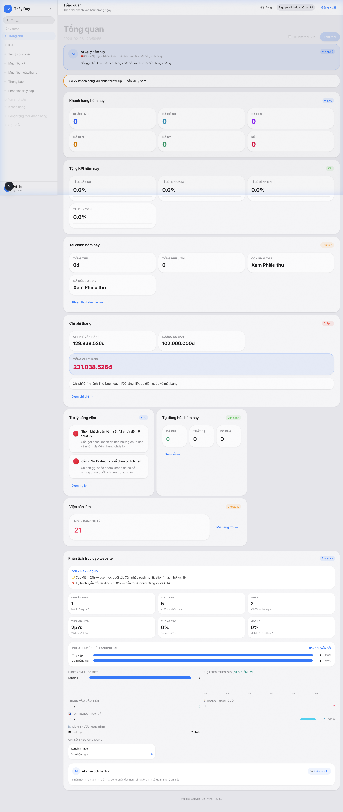 |
| Leads | 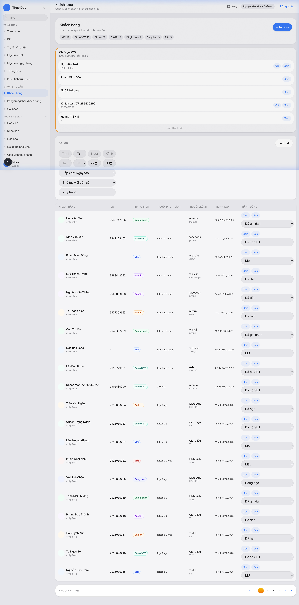 |
| Leads Board | 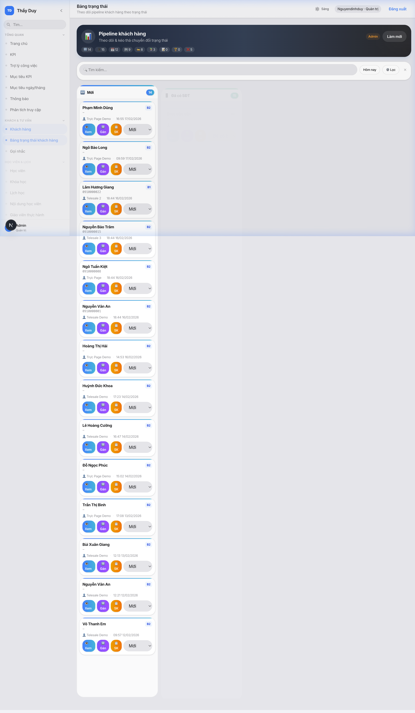 |
| Receipts | 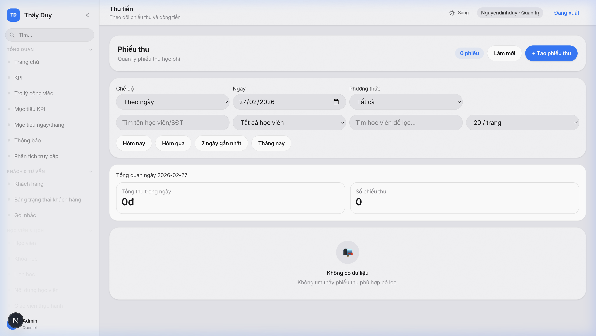 |
| Expenses | 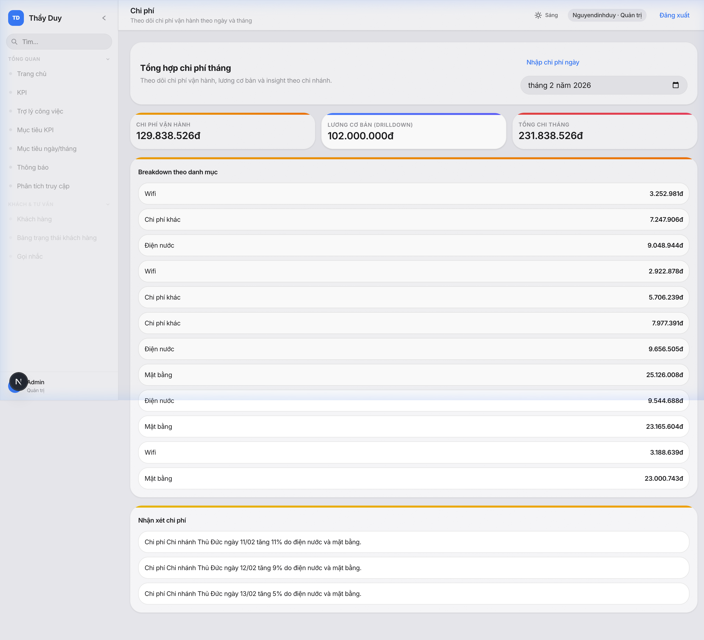 |
| Students | 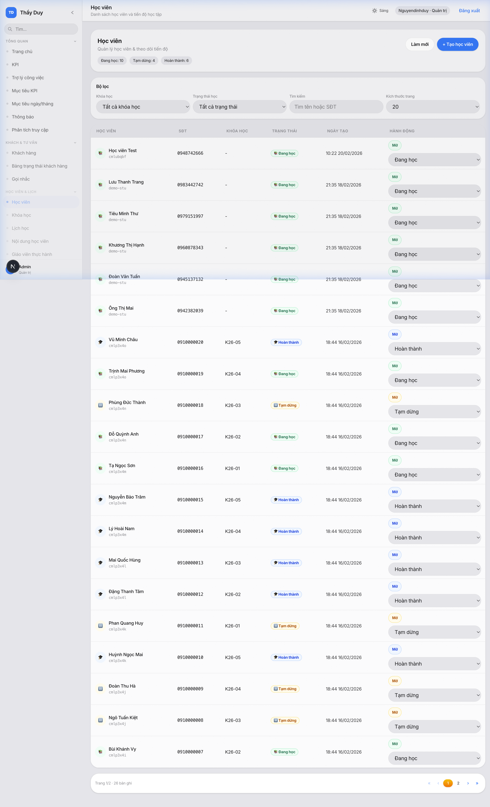 |
| Courses | 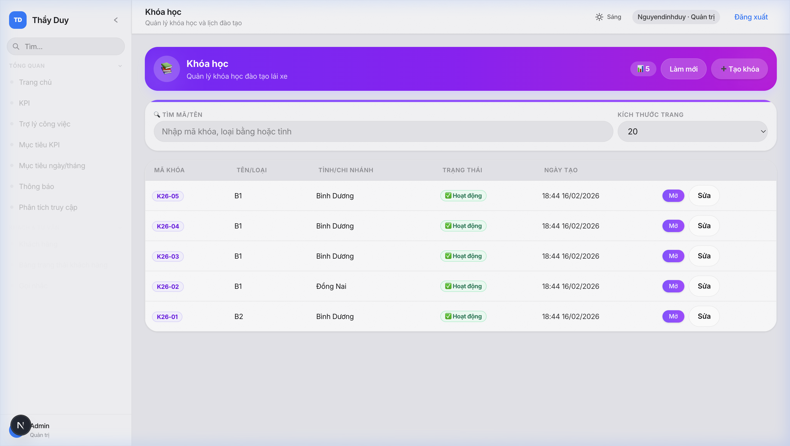 |
| Schedule | 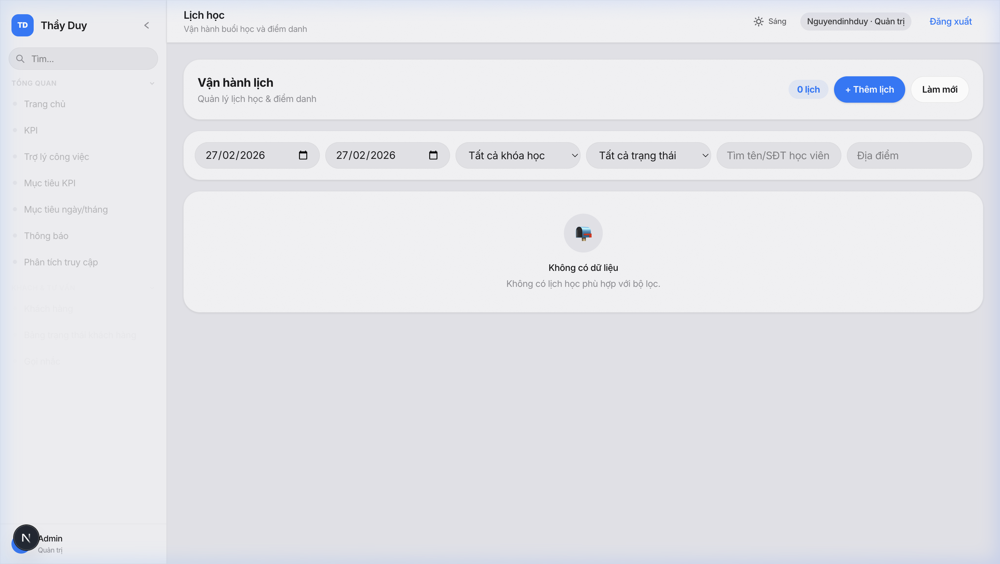 |
| KPI Daily | 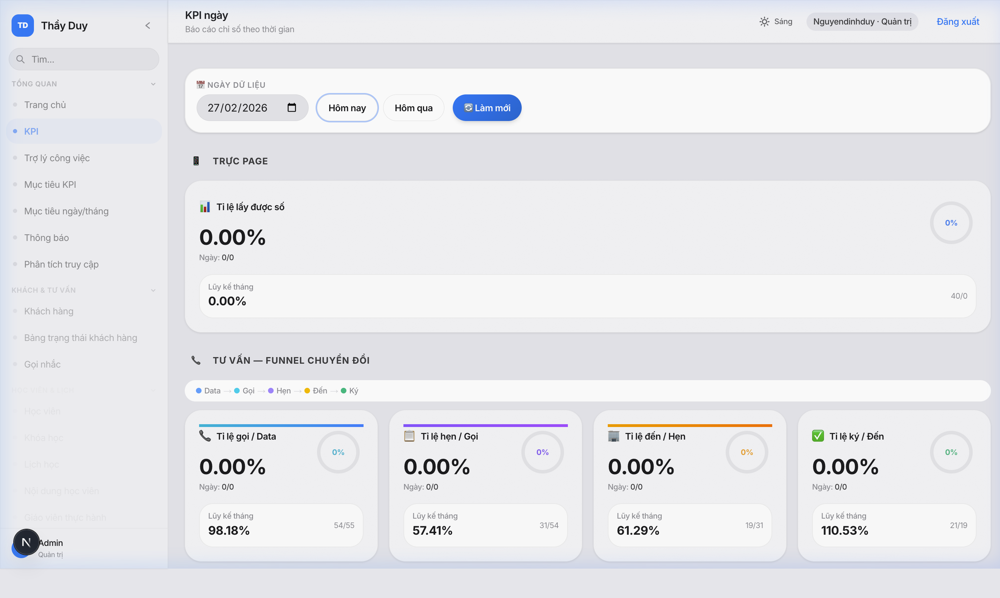 |
| KPI Targets | 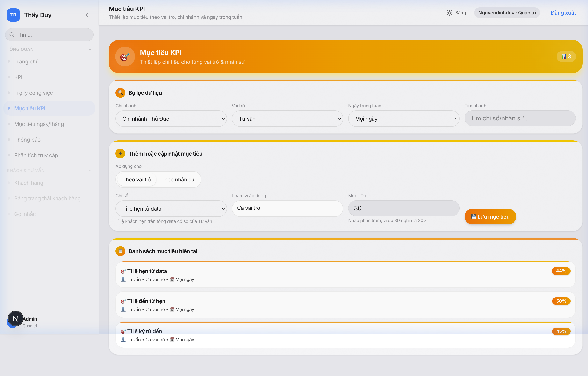 |

### Mobile (390px)

| Trang | Screenshot |
|-------|-----------|
| Dashboard | 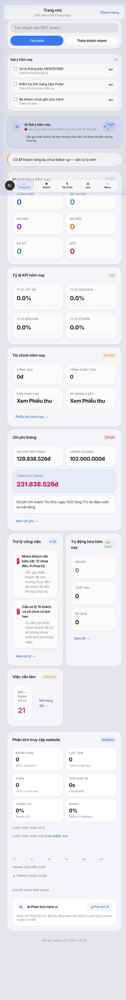 |
| Leads | 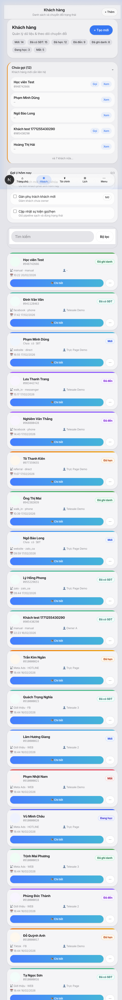 |
| Leads Board | 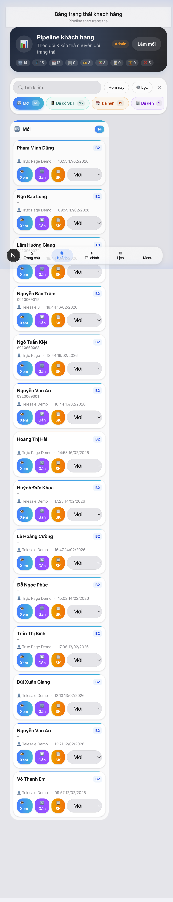 |
| Receipts | 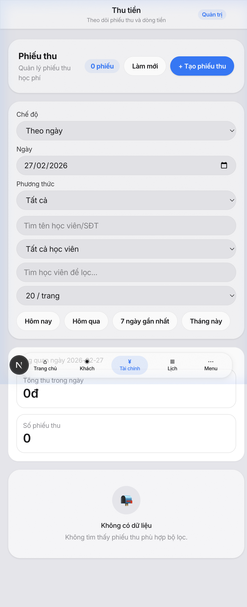 |
| Expenses | 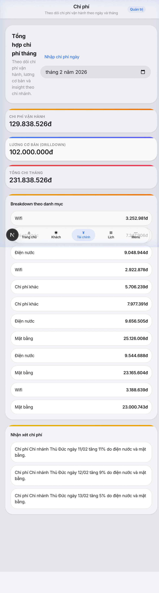 |
| Students | 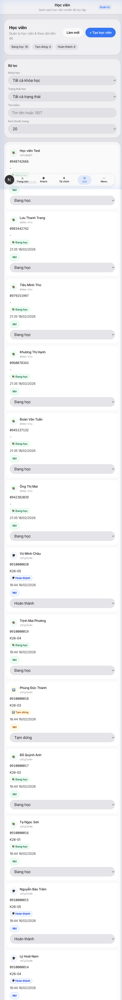 |
| Courses | 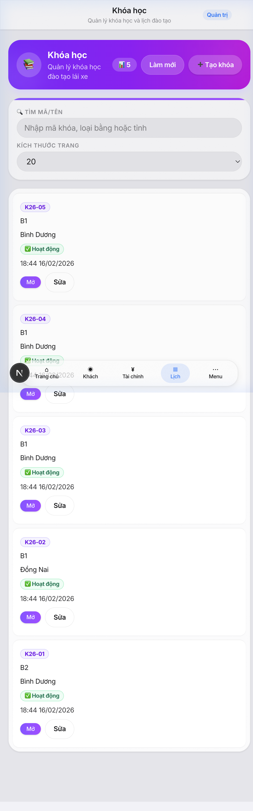 |
| Schedule | 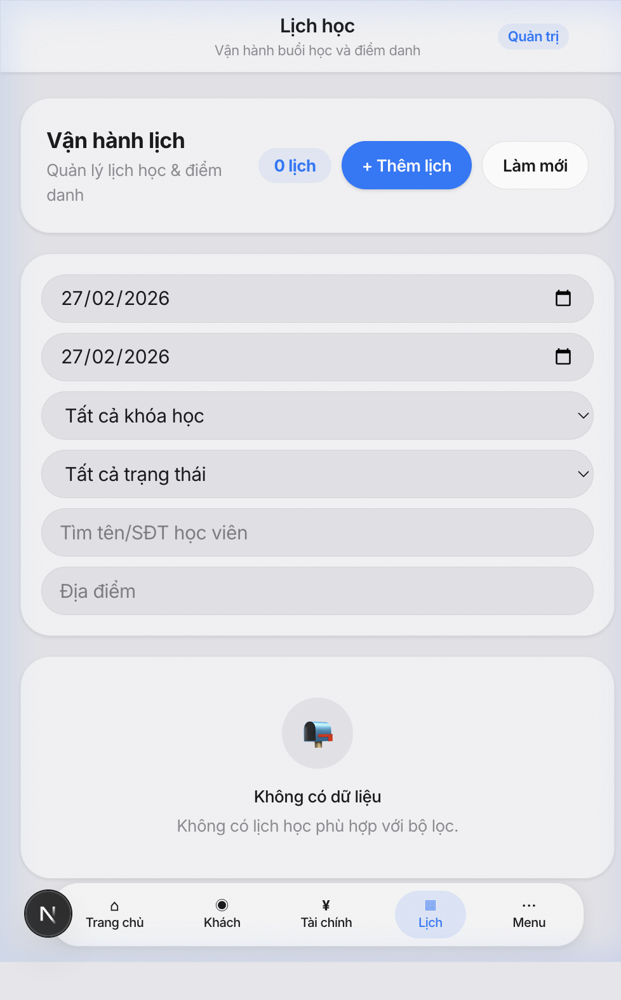 |
| KPI Daily | 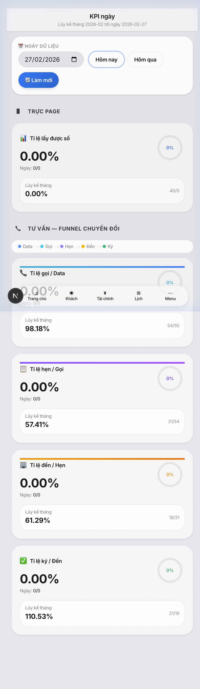 |
| KPI Targets | 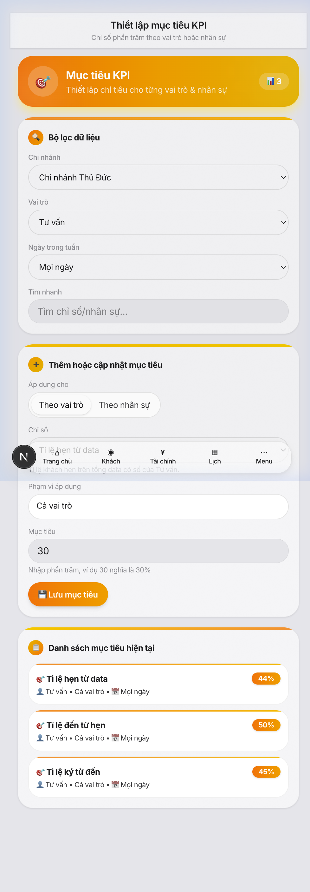 |

---

## 8. KẾT LUẬN

### Hiện trạng
- ✅ 53 trang đã chuyển sang Glass Design System (CSS vars thống nhất)
- ✅ Theme Auto/Light/Dark hoạt động
- ✅ Build pass, zero TS errors
- ⚠️ Một số hardcoded colors vẫn chưa 100% dark-mode ready
- ⚠️ Mobile table overflow ở nhiều trang
- ⚠️ Dashboard quá nặng (12 API calls, 1177 dòng)
- ⚠️ Leads page quá lớn (1447 dòng, cần tách)

### Ưu tiên tiếp theo
1. **P0:** Component chuẩn hoá (DateRangePicker, StatusBadge, FilterBar) + Dashboard tối ưu + Mobile card layout
2. **P1:** Tách file lớn, Board drag-drop, HR suite chuẩn hoá
3. **P2:** Global search, export CSV, keyboard shortcuts
