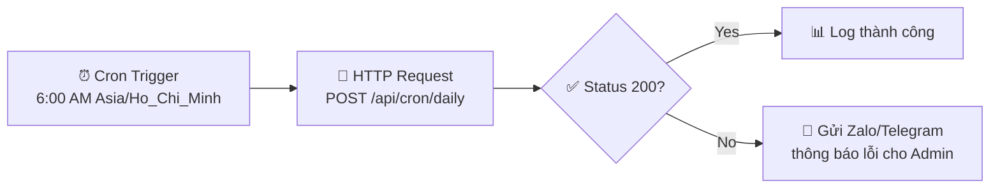
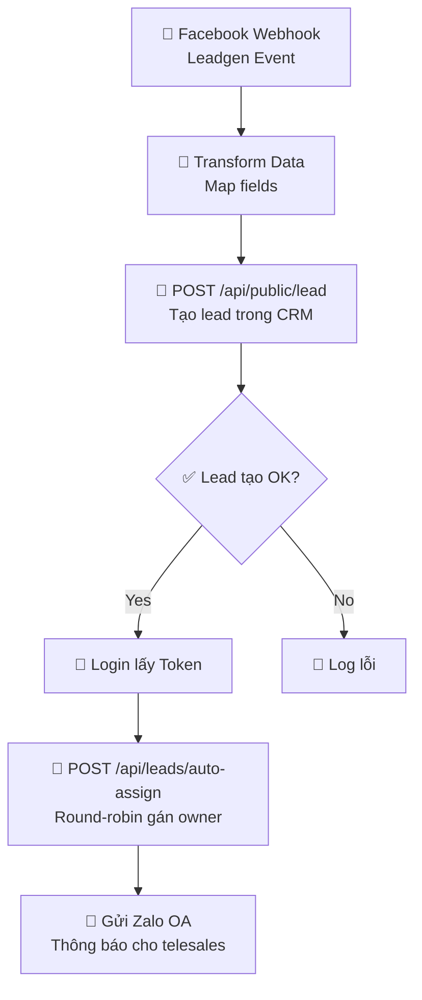
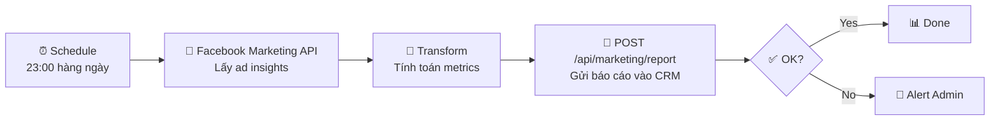
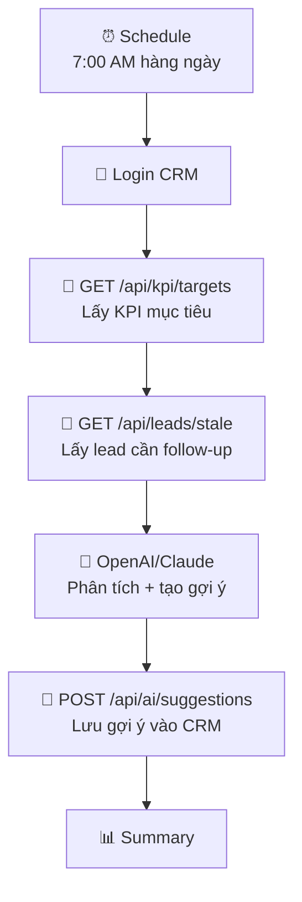
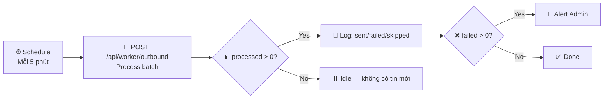
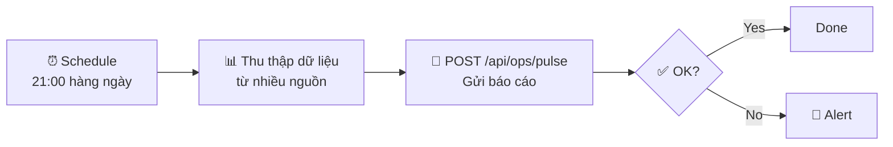
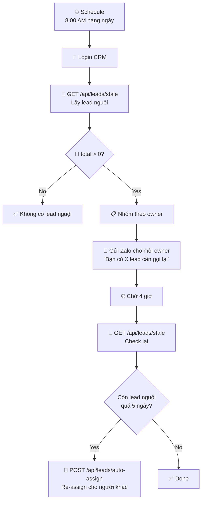
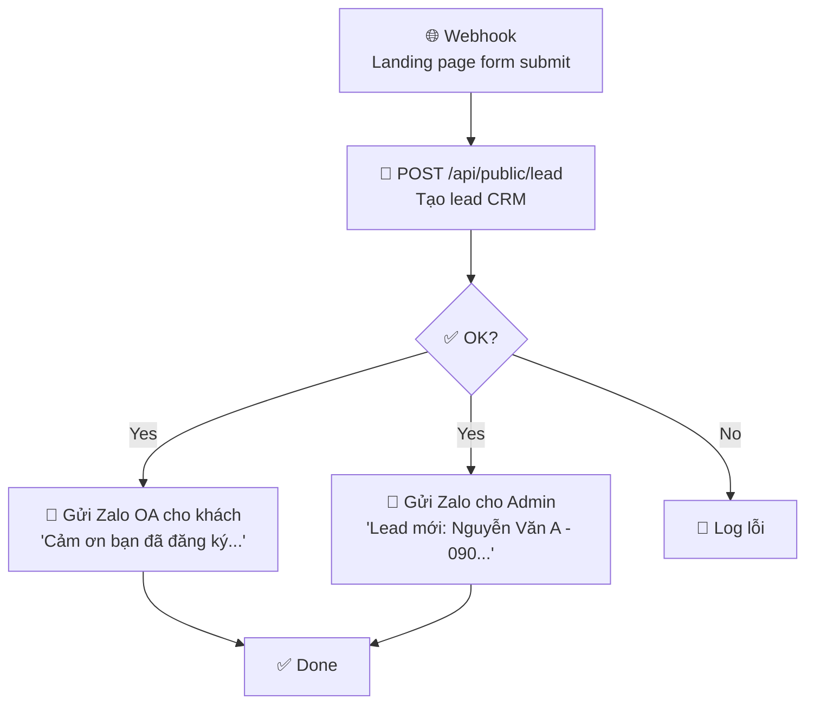

# N8N Workflow Templates cho CRM Thầy Duy

> Tài liệu hướng dẫn xây dựng các N8N workflow tự động hóa cho hệ thống CRM.
> Mỗi workflow bên dưới bao gồm: mục đích, sơ đồ luồng, request mẫu, và giải thích chi tiết.

## Mục lục

| # | Workflow | Trigger | Tần suất | Độ ưu tiên |
|---|----------|---------|----------|------------|
| 1 | [Daily Cron Master](#1-daily-cron-master) | Schedule | Mỗi ngày 6:00 AM | 🔴 Cao |
| 2 | [Facebook Lead Capture](#2-facebook-lead-capture) | Webhook (Facebook) | Real-time | 🔴 Cao |
| 3 | [Marketing Ads Sync](#3-marketing-ads-sync) | Schedule | Mỗi ngày 23:00 | 🟡 Trung bình |
| 4 | [AI KPI Coach](#4-ai-kpi-coach) | Schedule | Mỗi ngày 7:00 AM | 🟡 Trung bình |
| 5 | [Outbound Message Worker](#5-outbound-message-worker) | Schedule | Mỗi 5 phút | 🔴 Cao |
| 6 | [Ops Pulse Report](#6-ops-pulse-report) | Schedule | Mỗi ngày 21:00 | 🟡 Trung bình |
| 7 | [Stale Lead Alert & Auto-Assign](#7-stale-lead-alert--auto-assign) | Schedule | Mỗi ngày 8:00 AM | 🟡 Trung bình |
| 8 | [Landing Page → CRM → Zalo Notify](#8-landing-page--crm--zalo-notify) | Webhook | Real-time | 🔴 Cao |

---

## Cấu hình chung

### Biến môi trường N8N (Credentials)

```
CRM_BASE_URL    = https://crm.thayduydaotaolaixe.com
CRM_EMAIL       = admin@thayduy.local
CRM_PASSWORD    = Admin@123456

# Service secrets (phải khớp với .env CRM server)
CRON_SECRET     = <your-cron-secret>
WORKER_SECRET   = <your-worker-secret>
OPS_SECRET      = <your-ops-secret>
MARKETING_SECRET = <your-marketing-secret>
```

### Cách lấy Bearer Token

Nhiều API yêu cầu Bearer Token. Tạo một node **HTTP Request** đầu tiên:

```
POST {{CRM_BASE_URL}}/api/auth/login
Content-Type: application/json

{
  "account": "{{CRM_EMAIL}}",
  "password": "{{CRM_PASSWORD}}"
}
```

Response sẽ trả về `token`. Sử dụng **Set node** để lưu:
```
{{ $json.token }}  →  biến "bearerToken"
```

Các node sau dùng header: `Authorization: Bearer {{bearerToken}}`

---

## 1. Daily Cron Master

### Mục đích
Workflow trung tâm chạy mỗi ngày sáng sớm. Gọi API cron/daily để kích hoạt tất cả logic hàng ngày: đánh dấu lead cũ, tạo notification follow-up, tính KPI tự động, và dọn dữ liệu tạm.

### Sơ đồ luồng



### Request mẫu

```http
POST {{CRM_BASE_URL}}/api/cron/daily
Content-Type: application/json
x-cron-secret: {{CRON_SECRET}}

{
  "force": false,
  "dryRun": false
}
```

### Response mẫu

```json
{
  "ok": true,
  "staleLeadsMarked": 12,
  "notificationsCreated": 8,
  "kpiUpdated": true,
  "executedAt": "2026-02-18T06:00:01.234Z"
}
```

### Giải thích từng node

| Node | Loại | Cấu hình |
|------|------|----------|
| Cron Trigger | Schedule Trigger | Lặp: mỗi ngày, 6:00 AM, timezone `Asia/Ho_Chi_Minh` |
| HTTP Request | HTTP Request | Method: POST, URL: `/api/cron/daily`, Header: `x-cron-secret` |
| Check Status | IF | Điều kiện: `{{ $json.ok === true }}` |
| Log thành công | Set | Lưu kết quả vào biến để ghi log |
| Gửi Alert | HTTP/Telegram | Gửi thông báo lỗi nếu cron fail |

### Tham số tuỳ chỉnh
- `force: true` — bỏ qua kiểm tra "đã chạy hôm nay chưa", buộc chạy lại
- `dryRun: true` — chạy thử, không thực sự thay đổi dữ liệu (dùng để test)

---

## 2. Facebook Lead Capture

### Mục đích
Khi có lead mới từ Facebook Lead Ads, tự động tạo lead trong CRM, gán cho nhân viên telesales theo round-robin, và gửi thông báo qua Zalo cho nhân viên được gán.

### Sơ đồ luồng



### Các request mẫu

**Bước 1: Tạo lead (Public API — không cần auth)**
```http
POST {{CRM_BASE_URL}}/api/public/lead
Content-Type: application/json

{
  "fullName": "Nguyễn Văn A",
  "phone": "0901234567",
  "province": "TP.HCM",
  "licenseType": "B2"
}
```

**Bước 2: Login lấy token**
```http
POST {{CRM_BASE_URL}}/api/auth/login
Content-Type: application/json

{
  "account": "admin@thayduy.local",
  "password": "Admin@123456"
}
```

**Bước 3: Auto-assign round-robin**
```http
POST {{CRM_BASE_URL}}/api/leads/auto-assign
Content-Type: application/json
Authorization: Bearer {{token}}

{
  "strategy": "round_robin",
  "filters": {
    "status": "HAS_PHONE",
    "ownerId": null
  }
}
```

### Giải thích
- **Facebook Webhook**: N8N nhận event `leadgen` từ Facebook Lead Ads. Cần cấu hình Facebook App webhook URL trỏ về N8N.
- **Transform**: Map field Facebook → CRM. Facebook trả `full_name`, `phone_number`, CRM cần `fullName`, `phone`.
- **Public Lead**: API public, không cần auth. Có rate-limit 10 req/phút. Nếu phone trùng sẽ cập nhật thay vì lỗi.
- **Auto-assign**: Chia đều lead chưa có owner cho tất cả telesales đang active theo thứ tự round-robin.

### Lưu ý chống trùng
- CRM tự xử lý phone trùng: nếu SĐT đã tồn tại, update `updatedAt` để đẩy lead lên đầu danh sách.

---

## 3. Marketing Ads Sync

### Mục đích
Đồng bộ chi phí quảng cáo Facebook/Meta Ads hàng ngày vào CRM để hiển thị trên dashboard marketing — theo dõi CPL (cost per lead), tổng chi tiêu, và số messages.

### Sơ đồ luồng



### Request mẫu

```http
POST {{CRM_BASE_URL}}/api/marketing/report
Content-Type: application/json
x-marketing-secret: {{MARKETING_SECRET}}

{
  "date": "2026-02-18",
  "source": "meta",
  "spendVnd": 2500000,
  "messages": 45,
  "branchCode": "Q1",
  "meta": {
    "campaignName": "B2_HCMC_Feb2026",
    "impressions": 15000,
    "clicks": 320,
    "ctr": 2.13
  }
}
```

### Response mẫu

```json
{
  "ok": true,
  "item": {
    "id": "clxyz...",
    "dateKey": "2026-02-18",
    "source": "meta",
    "spendVnd": 2500000,
    "messages": 45,
    "cplVnd": 55556
  }
}
```

### Giải thích
- **Facebook Marketing API**: Dùng Facebook Graph API v21.0 endpoint `/act_{ad_account_id}/insights` để lấy dữ liệu chi tiêu và kết quả.
- **Transform**: Chuyển đổi currency (USD → VND nếu cần), tính metrics phụ.
- **Upsert**: API sử dụng upsert — nếu ngày đã có dữ liệu sẽ cập nhật thay vì tạo mới.
- **branchCode**: Mã chi nhánh (vd: `Q1`, `Q7`). Nếu không truyền sẽ dùng chi nhánh mặc định.

---

## 4. AI KPI Coach

### Mục đích
Phân tích dữ liệu KPI hàng ngày bằng AI (GPT/Claude), tạo gợi ý cho từng nhân viên telesales/page dựa trên hiệu suất thực tế. Gợi ý sẽ hiện trên dashboard dưới dạng "AI Gợi ý hôm nay".

### Sơ đồ luồng



### Request mẫu — Ghi gợi ý AI

```http
POST {{CRM_BASE_URL}}/api/ai/suggestions
Content-Type: application/json
Authorization: Bearer {{token}}

{
  "dateKey": "2026-02-18",
  "role": "telesales",
  "branchId": "branch-id-here",
  "ownerId": "user-id-telesale1",
  "title": "📞 Cần gọi lại 5 khách đã hẹn nhưng chưa đến",
  "content": "Bạn có 5 khách ở trạng thái APPOINTED quá 2 ngày chưa đến. Hãy ưu tiên gọi lại nhóm này trước 11h sáng khi tỷ lệ bắt máy cao nhất.",
  "scoreColor": "YELLOW",
  "actionsJson": [
    {"label": "Xem danh sách", "url": "/leads?status=APPOINTED&ownerId=user-id"},
    {"label": "Gọi nhắc hàng loạt", "action": "bulk-call"}
  ],
  "metricsJson": {
    "appointedCount": 5,
    "daysSinceAppointAvg": 3.2,
    "showUpRate": "60%"
  }
}
```

### Giải thích
- **Lấy KPI targets**: Trả về mục tiêu ngày/tháng (vd: "Hôm nay telesales cần đạt 10 cuộc gọi, 3 hẹn").
- **Lấy stale leads**: Trả về lead cần follow-up (HAS_PHONE > 3 ngày, APPOINTED > 2 ngày).
- **Prompt AI**: Trộn 2 nguồn dữ liệu trên + KPI thực tế → prompt cho GPT/Claude phân tích và tạo gợi ý cá nhân hóa.
- **scoreColor**: `RED` (cần hành động ngay), `YELLOW` (cần chú ý), `GREEN` (đang OK).
- **actionsJson**: Nút hành động nhanh hiện trên dashboard.

### Prompt AI mẫu

```
Bạn là AI Coach cho CRM đào tạo lái xe. Dựa trên dữ liệu KPI hôm nay:
- Mục tiêu gọi: {{target_calls}}, Thực tế: {{actual_calls}}
- Mục tiêu hẹn: {{target_appointments}}, Thực tế: {{actual_appointments}}
- Lead cần follow: {{stale_leads_count}} khách

Hãy tạo 1-3 gợi ý ngắn gọn, thực tế, bằng tiếng Việt.
Mỗi gợi ý gồm: title (tiêu đề), content (nội dung chi tiết), scoreColor (RED/YELLOW/GREEN).
```

---

## 5. Outbound Message Worker

### Mục đích
Xử lý hàng đợi tin nhắn outbound (Zalo, SMS, Facebook). Worker lấy batch messages có status QUEUED, gửi qua channel tương ứng, cập nhật trạng thái. Chạy liên tục mỗi 5 phút.

### Sơ đồ luồng



### Request mẫu

```http
POST {{CRM_BASE_URL}}/api/worker/outbound
Content-Type: application/json
x-worker-secret: {{WORKER_SECRET}}

{
  "batchSize": 20,
  "concurrency": 5,
  "dryRun": false,
  "retryFailedOnly": false,
  "force": false
}
```

### Response mẫu

```json
{
  "processed": 15,
  "sent": 12,
  "failed": 2,
  "skipped": 1,
  "rateLimited": 0,
  "webhookEnabled": true,
  "duration": 3420
}
```

### Giải thích
- **batchSize**: Số tin nhắn xử lý mỗi lần (mặc định 20, tối đa 100).
- **concurrency**: Số luồng gửi song song (vd: 5 tin nhắn gửi đồng thời).
- **retryFailedOnly**: `true` = chỉ retry lại tin đã lỗi, bỏ qua tin mới.
- **force**: `true` = bỏ qua rate-limit check.
- **Nên cấu hình alert** khi `failed > 0` để admin biết có tin gửi lỗi.

---

## 6. Ops Pulse Report

### Mục đích
Tổng hợp dữ liệu hoạt động cuối ngày: số lead mới, cuộc gọi, hẹn lịch, doanh thu... từ nhiều nguồn bên ngoài (nếu có), đẩy vào CRM để hiển thị trên dashboard quản lý.

### Sơ đồ luồng



### Request mẫu

```http
POST {{CRM_BASE_URL}}/api/ops/pulse
Content-Type: application/json
x-ops-secret: {{OPS_SECRET}}

{
  "date": "2026-02-18",
  "branchCode": "Q1",
  "role": "TELESALES",
  "stats": {
    "newLeads": 8,
    "callsMade": 45,
    "appointments": 12,
    "showUps": 7,
    "signed": 3,
    "revenue": 15000000
  },
  "source": "n8n-daily-pulse"
}
```

### Giải thích
- **role**: `PAGE` hoặc `TELESALES` — tách riêng thống kê theo loại nhân viên.
- **branchCode**: Mã chi nhánh. Sử dụng khi có nhiều cơ sở.
- **stats**: Số liệu thống kê tổng hợp. Có thể tùy chỉnh fields.
- CRM sẽ tính toán thêm (tỷ lệ chuyển đổi, so sánh ngày trước) và lưu vào `computedJson`.

---

## 7. Stale Lead Alert & Auto-Assign

### Mục đích
Tìm lead "nguội" (đã lâu không follow-up), gửi cảnh báo cho telesales qua Zalo/Telegram, và tự động assign lại nếu owner không xử lý.

### Sơ đồ luồng



### Request mẫu — Lấy stale leads

```http
GET {{CRM_BASE_URL}}/api/leads/stale?page=1&pageSize=50
Authorization: Bearer {{token}}
```

### Response mẫu

```json
{
  "items": [
    {
      "id": "lead-id-1",
      "fullName": "Trần Văn B",
      "phone": "0912345678",
      "status": "HAS_PHONE",
      "daysSinceUpdate": 5,
      "warningLevel": "HIGH",
      "owner": {
        "id": "user-id-1",
        "name": "Telesale Demo",
        "email": "telesale1@thayduy.local"
      }
    }
  ],
  "page": 1,
  "pageSize": 50,
  "total": 3
}
```

### Giải thích
- **warningLevel**: `HIGH` (≥5 ngày), `MEDIUM` (≥3 ngày), `LOW` (< 3 ngày).
- Workflow 2 giai đoạn: cảnh báo trước → auto-reassign sau nếu không xử lý.
- Chỉ re-assign lead có `warningLevel: HIGH` (quá 5 ngày).

---

## 8. Landing Page → CRM → Zalo Notify

### Mục đích
Khi khách hàng điền form trên landing page, webhook gửi data vào CRM, đồng thời gửi tin nhắn Zalo cho khách xác nhận đã nhận thông tin, và thông báo cho admin/telesales biết có khách mới.

### Sơ đồ luồng



### Request mẫu

```http
POST {{CRM_BASE_URL}}/api/public/lead
Content-Type: application/json

{
  "fullName": "Nguyễn Thị C",
  "phone": "0987654321",
  "province": "Bình Dương",
  "licenseType": "B1"
}
```

### Giải thích
- **Không cần auth** — API public, có rate-limit 10 request/phút.
- **Anti-spam**: Nếu gửi field `_hp` (honeypot), CRM sẽ bỏ qua nhưng vẫn trả `ok: true`.
- **Phone trùng**: Nếu SĐT đã tồn tại, CRM cập nhật thông tin còn thiếu thay vì lỗi.
- **Zalo OA**: Sử dụng Zalo OA API để gửi tin nhắn tự động cho khách.

---

## Tổng hợp API Endpoints

### Nhóm 1: Service Secret (không cần login)

| Endpoint | Secret Header | Mục đích |
|----------|--------------|----------|
| `POST /api/cron/daily` | `x-cron-secret` | Chạy cron hàng ngày |
| `POST /api/worker/outbound` | `x-worker-secret` | Xử lý hàng đợi tin nhắn |
| `POST /api/marketing/report` | `x-marketing-secret` | Báo cáo chi phí marketing |
| `POST /api/marketing/ingest` | `x-marketing-secret` | Nhập dữ liệu marketing (deprecated) |
| `POST /api/ops/pulse` | `x-ops-secret` | Báo cáo hoạt động cuối ngày |

### Nhóm 2: Bearer Token (cần login trước)

| Endpoint | Method | Mục đích |
|----------|--------|----------|
| `/api/auth/login` | POST | Lấy Bearer token |
| `/api/leads/stale` | GET | Danh sách lead nguội |
| `/api/leads/auto-assign` | POST | Tự động gán owner round-robin |
| `/api/ai/suggestions` | GET/POST | Đọc/tạo gợi ý AI |
| `/api/notifications/generate` | POST | Tạo notification (admin only) |
| `/api/outbound/dispatch` | POST | Dispatch tin nhắn outbound (admin) |
| `/api/automation/run` | POST | Chạy automation thủ công |

### Nhóm 3: Public (không cần auth)

| Endpoint | Method | Mục đích |
|----------|--------|----------|
| `/api/public/lead` | POST | Tạo lead từ landing page |

---

## Tips triển khai N8N

1. **Error handling**: Luôn thêm node "Error Trigger" và gửi alert qua Zalo/Telegram khi workflow fail.
2. **Credentials**: Tạo một N8N Credential chung cho CRM base URL và secrets.
3. **Retry**: Cấu hình retry 3 lần với delay 30s cho HTTP Request nodes.
4. **Timezone**: Tất cả schedule trigger phải set timezone `Asia/Ho_Chi_Minh`.
5. **Logging**: Sử dụng N8N workflow execution history để debug. Giữ history 30 ngày.
6. **Token refresh**: Bearer token có thời hạn. Nên login mới mỗi lần workflow chạy thay vì cache token.
