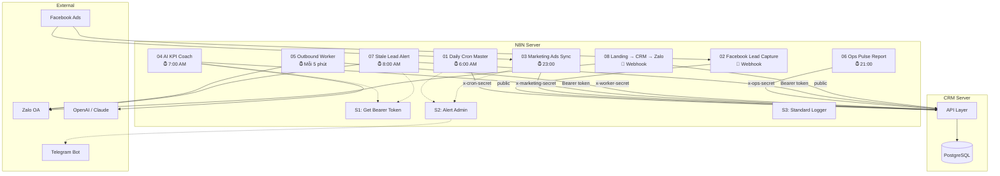

# N8N Workflows — Tổng quan kiến trúc

> Tài liệu master cho hệ thống N8N automation của CRM Thầy Duy.
> Chuẩn "production-ready" — import workflow JSON, set env, chạy ngay.

---

## Kiến trúc tổng thể



---

## Catalog workflow

| # | Workflow | File JSON | Trigger | Auth | Endpoint chính |
|---|---------|-----------|---------|------|----------------|
| S1 | Get Bearer Token | `s1-get-bearer-token.json` | Sub-workflow | — | `POST /api/auth/login` |
| S2 | Alert Admin | `s2-alert-admin.json` | Sub-workflow | — | Telegram Bot API |
| S3 | Standard Logger | `s3-standard-logger.json` | Sub-workflow | — | Console / webhook |
| 01 | Daily Cron Master | `01-daily-cron-master.json` | Cron 6:00 AM | `x-cron-secret` | `POST /api/cron/daily` |
| 02 | Facebook Lead Capture | `02-facebook-lead-capture.json` | FB Webhook | Public | `POST /api/public/lead` |
| 03 | Marketing Ads Sync | `03-marketing-ads-sync.json` | Cron 23:00 | `x-marketing-secret` | `POST /api/marketing/report` |
| 04 | AI KPI Coach | `04-ai-kpi-coach.json` | Cron 7:00 AM | Bearer Token | `POST /api/ai/suggestions` |
| 05 | Outbound Worker | `05-outbound-message-worker.json` | Cron */5 min | `x-worker-secret` | `POST /api/worker/outbound` |
| 06 | Ops Pulse Report | `06-ops-pulse-report.json` | Cron 21:00 | `x-ops-secret` | `POST /api/ops/pulse` |
| 07 | Stale Lead Alert | `07-stale-lead-alert-auto-assign.json` | Cron 8:00 AM | Bearer Token | `GET /api/leads/stale` |
| 08 | Landing → CRM → Zalo | `08-landing-crm-zalo-notify.json` | Webhook | Public | `POST /api/public/lead` |

---

## Credentials (N8N Environment Variables)

> **CRITICAL**: Không bao giờ hardcode secret trong workflow JSON. Luôn dùng `{{ $env.VAR_NAME }}`.

| Variable | Mô tả | Ví dụ |
|----------|--------|-------|
| `CRM_BASE_URL` | URL CRM server | `https://crm.thayduydaotaolaixe.com` |
| `CRM_EMAIL` | Email admin để lấy token | `admin@thayduy.local` |
| `CRM_PASSWORD` | Password admin | `Admin@123456` |
| `CRON_SECRET` | Secret cho `/api/cron/daily` | (khớp với server `.env`) |
| `WORKER_SECRET` | Secret cho `/api/worker/outbound` | (khớp với server `.env`) |
| `OPS_SECRET` | Secret cho `/api/ops/pulse` | (khớp với server `.env`) |
| `MARKETING_SECRET` | Secret cho `/api/marketing/report` | (khớp với server `.env`) |
| `TELEGRAM_BOT_TOKEN` | Token Telegram Bot cho alert | `123456:ABC-DEF1234ghIkl-zyx57W2v1u123ew11` |
| `TELEGRAM_CHAT_ID` | Chat ID group admin | `-1001234567890` |
| `ZALO_OA_ACCESS_TOKEN` | Zalo OA access token | (lấy từ Zalo Business) |

### Cách set env trong N8N
```
# Docker
docker run -e CRM_BASE_URL=https://crm.thayduydaotaolaixe.com \
           -e CRON_SECRET=your-secret \
           n8nio/n8n

# Hoặc trong .env
N8N_ENCRYPTION_KEY=your-encryption-key
CRM_BASE_URL=https://crm.thayduydaotaolaixe.com
CRON_SECRET=your-secret
```

---

## Sub-workflows tiêu chuẩn

### S1: Get Bearer Token
- **Input**: (không có)
- **Output**: `{ bearerToken: string, userId: string }`
- **Logic**: POST `/api/auth/login` → extract `token` + `user.id`
- **Dùng bởi**: W04 (AI KPI Coach), W07 (Stale Lead Alert)
- **Lưu ý**: Token chỉ sống trong execution context. Không cache cross-execution.

### S2: Alert Admin
- **Input**: `{ workflowName: string, error: string, endpoint: string, statusCode: number }`
- **Output**: `{ sent: boolean }`
- **Logic**: Format message → gửi Telegram Bot API
- **Dùng bởi**: Tất cả workflow (khi gặp lỗi)
- **Template message**:
```
🚨 [CRM N8N] Workflow FAIL
━━━━━━━━━━━━━━━━━━━━
Workflow: {{workflowName}}
Endpoint: {{endpoint}}
Status: {{statusCode}}
Error: {{error}}
Time: {{$now.format('HH:mm dd/MM/yyyy')}}
━━━━━━━━━━━━━━━━━━━━
```

### S3: Standard Logger
- **Input**: `{ workflowName, executionId, dateKey, branchCode, endpoint, statusCode, durationMs, payload }`
- **Output**: formatted log entry
- **Logic**: Format JSON log → console.log (N8N execution log)
- **CorrelationId**: `${workflowName}-${executionId}-${dateKey}`

---

## Quy ước đặt tên

### Workflow name
```
[CRM] 01 Daily Cron Master
[CRM] 02 Facebook Lead Capture
[CRM] S1 Get Bearer Token
```

### Node name prefix

| Prefix | Loại node |
|--------|-----------|
| `TRG_` | Trigger (Schedule, Webhook) |
| `AUTH_` | Authentication (Login, sub-workflow S1) |
| `HTTP_` | HTTP Request |
| `IF_` | IF / Switch |
| `MAP_` | Set / Code (transform data) |
| `LOG_` | Logger (sub-workflow S3) |
| `ALERT_` | Alert (sub-workflow S2) |
| `WAIT_` | Wait node |
| `LOOP_` | SplitInBatches |

---

## API Endpoints tổng hợp

### Nhóm 1: Service Secret

| Endpoint | Method | Secret Header | Nhận | Trả |
|----------|--------|--------------|------|-----|
| `/api/cron/daily` | POST | `x-cron-secret` | `{force, dryRun}` | `{ok, ...stats}` |
| `/api/worker/outbound` | POST | `x-worker-secret` | `{batchSize, concurrency, dryRun, retryFailedOnly, force}` | `{processed, sent, failed, skipped, rateLimited}` |
| `/api/marketing/report` | POST | `x-marketing-secret` | `{date, source, spendVnd, messages, branchCode, meta}` | `{ok, item}` |
| `/api/ops/pulse` | POST | `x-ops-secret` | `{role, branchId, ownerId, dateKey, metrics}` | `{ok, id, status, computedJson}` |

### Nhóm 2: Bearer Token

| Endpoint | Method | Nhận | Trả |
|----------|--------|------|-----|
| `/api/auth/login` | POST | `{account, password}` | `{token, user}` |
| `/api/leads/stale` | GET | `?page&pageSize` | `{items[], page, pageSize, total}` |
| `/api/leads/auto-assign` | POST | `{strategy:"round_robin", filters/leadIds}` | `{updated, assigned[]}` |
| `/api/ai/suggestions` | POST | `{dateKey, role, branchId, ownerId, title, content, scoreColor, actionsJson, metricsJson}` | suggestion object |
| `/api/kpi/targets` | GET | `?branchId` | KPI targets array |

### Nhóm 3: Public

| Endpoint | Method | Nhận | Trả |
|----------|--------|------|-----|
| `/api/public/lead` | POST | `{fullName, phone, province, licenseType}` | `{ok, message}` |

---

## Upgrade Plan (High Priority)

### 1. Tích hợp Zalo OA thật
- **Hiện tại**: Outbound worker ghi log nhưng mock gửi tin
- **Cần làm**: Kết nối Zalo ZNS API trong outbound worker
- **Dependencies**: Zalo OA account verified, ZNS template approved
- **N8N node**: Thêm HTTP Request node trong W05 gọi Zalo ZNS API sau khi CRM trả về danh sách messages
- **Estimate**: 2-3 ngày (1 ngày Zalo setup + 1-2 ngày code)

### 2. Webhook nhận lead Facebook/Zalo realtime
- **Hiện tại**: W02 cần N8N nhận webhook từ Facebook → transform → POST CRM
- **Cần làm**: Cấu hình Facebook App webhook, Zalo webhook
- **Dependencies**: Facebook App Business verified, Zalo OA webhook URL
- **N8N node**: Webhook trigger node trong W02 đã sẵn schema
- **Estimate**: 1-2 ngày (Facebook App setup + webhook testing)

### 3. Dashboard realtime (SSE)
- **Hiện tại**: Dashboard polling 60s
- **Cần làm**: Server-Sent Events endpoint `/api/sse/dashboard`
- **Dependencies**: CRM server code change (new API route)
- **N8N impact**: Không ảnh hưởng N8N workflows
- **Estimate**: 3-5 ngày (SSE endpoint + frontend integration)

---

## Quick start

```bash
# 1. Run all N8N simulation tests
npm run n8n:verify

# 2. Import workflows vào N8N
# Mở N8N UI → Workflows → Import → Chọn file JSON từ n8n/workflows/

# 3. Set environment variables trong N8N
# Settings → Environment Variables → Thêm CRM_BASE_URL, secrets...
```
