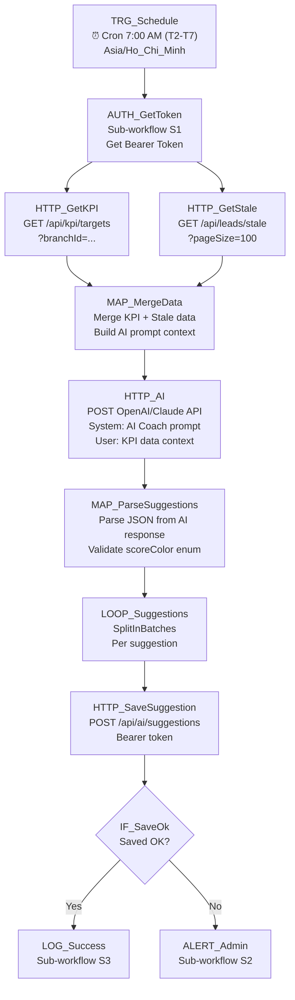

# 04 — AI KPI Coach

## 1. Mục đích + KPI

Phân tích dữ liệu KPI hàng ngày bằng AI (GPT/Claude), tạo gợi ý cá nhân hóa cho từng nhân viên telesales/page dựa trên hiệu suất thực tế. Gợi ý hiện trên dashboard CRM dưới dạng "AI Gợi ý hôm nay".

**KPI**: ≥ 3 gợi ý / ngày / chi nhánh. Feedback "helpful" ≥ 70%.

---

## 2. Trigger + Timezone + Tần suất

| Thuộc tính | Giá trị |
|-----------|---------|
| Trigger | Schedule Trigger (Cron) |
| Cron expression | `0 7 * * 1-6` |
| Timezone | `Asia/Ho_Chi_Minh` |
| Tần suất | Mỗi ngày làm việc (T2-T7) lúc 07:00 AM |
| Chạy CN | Không (weekend off) |

---

## 3. Input / Output

### Input (dữ liệu thu thập từ CRM)
| Source | Endpoint | Dữ liệu |
|--------|----------|----------|
| KPI targets | `GET /api/kpi/targets?branchId=X` | Mục tiêu ngày: call, appointed, arrived |
| Stale leads | `GET /api/leads/stale?pageSize=100` | Lead cần follow-up |
| Lead stats | `GET /api/leads?status=X` | Đếm lead theo status |

### Transform → AI Prompt
| CRM Data | Prompt Variable |
|----------|----------------|
| `kpiTargets.appointedRatePct` | `target_appointments_pct` |
| `staleLeads.total` | `stale_leads_count` |
| `staleLeads.items[].warningLevel` | `high_priority_count` |

### Output (ghi vào CRM)
| Field | Type | Mô tả |
|-------|------|--------|
| `dateKey` | string | `YYYY-MM-DD` |
| `role` | string | `telesales` / `direct_page` / `manager` |
| `title` | string | Tiêu đề gợi ý |
| `content` | string | Nội dung chi tiết |
| `scoreColor` | string | `RED` / `YELLOW` / `GREEN` |
| `actionsJson` | array | Nút hành động nhanh |
| `metricsJson` | object | Số liệu kèm theo |

---

## 4. Sơ đồ Node chi tiết



---

## 5. Bảng Node-by-Node

| # | Node Name | Node Type | Config quan trọng | Input mapping | Output | Error handling |
|---|-----------|-----------|-------------------|---------------|--------|----------------|
| 1 | `TRG_Schedule` | Schedule Trigger | Cron: `0 7 * * 1-6`, TZ: `Asia/Ho_Chi_Minh` | — | Trigger | — |
| 2 | `AUTH_GetToken` | Execute Sub-workflow | `[CRM] S1 Get Bearer Token` | — | `{bearerToken, userId}` | Fail → ALERT |
| 3 | `HTTP_GetKPI` | HTTP Request | GET `{{ $env.CRM_BASE_URL }}/api/kpi/targets`, Auth: Bearer | — | KPI targets JSON | Retry 2x |
| 4 | `HTTP_GetStale` | HTTP Request | GET `{{ $env.CRM_BASE_URL }}/api/leads/stale?pageSize=100`, Auth: Bearer | — | Stale leads JSON | Retry 2x |
| 5 | `MAP_MergeData` | Merge | Merge by index (KPI + stale) | Two inputs | Combined data | — |
| 6 | `HTTP_AI` | HTTP Request | POST `https://api.openai.com/v1/chat/completions`, Auth: API Key, Model: `gpt-4o-mini`, System prompt + User data | Merged context | AI response text | Retry 2x, timeout 60s |
| 7 | `MAP_ParseSuggestions` | Code | `JSON.parse(aiResponse)`, validate `scoreColor ∈ {RED,YELLOW,GREEN}`, ensure array | AI text | Array of suggestions | Default to YELLOW if invalid |
| 8 | `LOOP_Suggestions` | SplitInBatches | Batch size: 1 | Array | Single item | — |
| 9 | `HTTP_SaveSuggestion` | HTTP Request | POST `{{ $env.CRM_BASE_URL }}/api/ai/suggestions`, Auth: Bearer, Body: suggestion payload | Single suggestion | Saved record | Retry 2x |
| 10 | `IF_SaveOk` | IF | Check response has no error | CRM response | Route | — |
| 11 | `LOG_Success` | Execute Sub-workflow | `[CRM] S3` | All context | Log | — |
| 12 | `ALERT_Admin` | Execute Sub-workflow | `[CRM] S2` | Error context | Alert | — |

---

## 6. Request mẫu (curl)

### Lưu gợi ý AI
```bash
curl -s -X POST "${CRM_BASE_URL}/api/ai/suggestions" \
  -H "Content-Type: application/json" \
  -H "Authorization: Bearer ${TOKEN}" \
  -d '{
    "dateKey": "2026-02-18",
    "role": "telesales",
    "branchId": "branch-id",
    "ownerId": "user-id-ts1",
    "title": "📞 Cần gọi lại 5 khách đã hẹn nhưng chưa đến",
    "content": "Bạn có 5 khách trạng thái APPOINTED quá 2 ngày. Ưu tiên gọi trước 11h sáng.",
    "scoreColor": "YELLOW",
    "actionsJson": [{"label": "Xem danh sách", "url": "/leads?status=APPOINTED"}],
    "metricsJson": {"appointedCount": 5, "daysSinceAvg": 3.2}
  }'
```

### AI System Prompt
```
Bạn là AI Coach cho CRM đào tạo lái xe Thầy Duy. Phân tích dữ liệu KPI và tạo gợi ý.

Dữ liệu KPI hôm nay:
{{kpiData}}

Lead cần follow-up: {{staleCount}} khách ({{highPriorityCount}} ưu tiên cao)

Yêu cầu:
- Tạo 1-3 gợi ý ngắn gọn, tiếng Việt
- Mỗi gợi ý: {title, content, scoreColor: RED|YELLOW|GREEN, actionsJson, metricsJson}
- RED: cần hành động ngay, YELLOW: cần chú ý, GREEN: đang tốt
- Trả về JSON array
```

---

## 7. Idempotency & Anti-duplicate

| Aspect | Strategy |
|--------|----------|
| Ngày trùng | Nếu đã có suggestions cho dateKey + role + ownerId → CRM tạo thêm (không overwrite) |
| AI response trùng | Mỗi lần chạy tạo gợi ý mới (AI response khác nhau mỗi ngày) |
| Guard | Kiểm tra đã có suggestions cho dateKey trước khi gọi AI (tiết kiệm API cost) |

---

## 8. Retry / Backoff / Rate-limit

| Cấu hình | Giá trị |
|----------|---------|
| CRM API retry | `2` lần, backoff `3000ms` |
| OpenAI API retry | `2` lần, backoff `10000ms` |
| OpenAI timeout | `60000ms` (AI response có thể lâu) |
| OpenAI rate-limit (429) | Wait 60s rồi retry |
| Tổng timeout workflow | `180000ms` (3 phút) |

---

## 9. Observability

### Log fields
```json
{
  "correlationId": "04-ai-coach-{executionId}-{dateKey}",
  "workflowName": "04-ai-kpi-coach",
  "dateKey": "2026-02-18",
  "suggestionsCreated": 3,
  "aiModel": "gpt-4o-mini",
  "aiTokensUsed": 450,
  "durationMs": 8500
}
```

### Alert
| Khi nào | Gửi tới |
|---------|---------|
| AI API fail | Telegram admin |
| CRM save fail | Telegram admin |
| 0 suggestions generated | LOG warning |

---

## 10. Runbook vận hành

### Test nhanh
```bash
# Kiểm tra KPI data có sẵn
curl -s "${CRM_BASE_URL}/api/kpi/targets" \
  -H "Authorization: Bearer ${TOKEN}" | python3 -m json.tool

# Kiểm tra stale leads
curl -s "${CRM_BASE_URL}/api/leads/stale?pageSize=5" \
  -H "Authorization: Bearer ${TOKEN}" | python3 -m json.tool
```

### Debug
1. Kiểm tra OpenAI API key còn valid không
2. Check AI response format: phải trả JSON array
3. Check CRM suggestions: `GET /api/ai/suggestions?date=today`

### Checklist
- [ ] `CRM_BASE_URL`, `CRM_EMAIL`, `CRM_PASSWORD`
- [ ] `OPENAI_API_KEY` hoặc `ANTHROPIC_API_KEY`
- [ ] AI model: `gpt-4o-mini` (tiết kiệm) hoặc `gpt-4o` (chính xác hơn)
